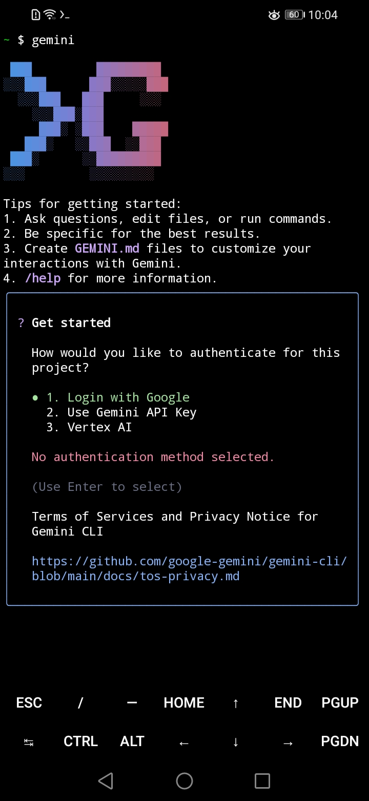

# 🦞 OpenClaw Android (Termux) Toolkit

<p align="center">
  
</p>

[](https://opensource.org/licenses/MIT)
[](https://github.com/niyazmft/openclaw-android-toolkit)
[-green.svg)](https://termux.dev/)

A high-performance, automated toolkit for running [OpenClaw](https://github.com/the-claw-team/openclaw), [Gemini CLI](https://github.com/google/gemini-cli), and **n8n Server** natively on non-rooted Android devices. This toolkit bypasses kernel restrictions (`renameat2`), patches hardcoded system paths, and optimizes execution for mobile environments.

---

## 📱 Compatibility

- **OS**: Android 9.0 and above.
- **Architecture**: Tested on `armv8l` (32-bit) and `aarch64` (64-bit) CPUs.
- **Optimization**: Automatically detects system RAM and recommends appropriate memory limits (512MB to 2048MB) for Node.js and n8n workloads.
- **Package Managers**: Supports both **npm** (Standard) and **pnpm** (High Efficiency) for all tools.
- **Process Management**: Supports **PM2** (Recommended) and **termux-services** (Native).

---

## 🚀 Quick Start

### 1. Environment Setup
Install **Termux** from [F-Droid](https://f-droid.org/en/packages/com.termux/). Do **not** use the Play Store version as it is obsolete.

### 2. Run the Toolkit
Execute the following command to start the interactive toolkit:
```bash
curl -sSL https://raw.githubusercontent.com/niyazmft/openclaw-android-toolkit/main/install.sh | bash
```
> 💡 **Smart Repair (v1.5.0+):** If a tool is already installed, the toolkit offers a **[R] Repair** mode. Use this to fix Android-specific patches in seconds without re-downloading the entire package.

### 3. Onboard (For OpenClaw)
Initialize your account and API providers:
```bash
openclaw onboard
```
*Select **QuickStart** and choose an external provider (OpenRouter, OpenAI, etc.).*

### 4. Background Service (Optimized)
To keep OpenClaw running even after you close Termux:
1. Run the toolkit again and choose **Option 5 (Manage PM2 Processes)**.
2. Select **Start OpenClaw with PM2**.
3. View logs with: `pm2 logs openclaw`

---

## ✨ Key Features

- 🛠 **Smart Repair**: Detects existing installations and provides a 2-second "Repair Only" path to re-apply patches without redundant downloads.
- 🩹 **Zero-Config Patching**: Automatically fixes the `koffi` native bridge and `renameat2` kernel crashes for OpenClaw.
- 📂 **Path Awareness**: Aggressively redirects `/bin/npm`, `/bin/node`, and `/tmp` to Termux-compatible directories using `$PREFIX`.
- 🚀 **PM2 Integration**: Native support for starting, stopping, and monitoring OpenClaw and n8n via PM2 with optimized memory flags.
- 📦 **pnpm Support**: Integrated support for pnpm to speed up installations and save storage space.
- 🧠 **Memory Guard**: Automatically clears memory (PM2 kill) and increases Node.js heap limits (1.5GB+) to prevent crashes on low-RAM devices during updates.
- 🛡 **Surgical Cleanup**: The uninstaller offers **Soft/Deep** options and a **Wipe Stack (Reset)** function that preserves your system packages while cleaning the apps.
- 🧩 **Gemini CLI Support**: Dedicated installer with NDK environment optimizations.

<p align="center">
  
</p>

---

## 🗑 Uninstallation & Reset

Run the toolkit and select **Option 7** to access the modular uninstallation menu. Each option provides a detailed summary of the impact before you confirm:

- **Remove OpenClaw only**: 
  - Choice of **Soft Uninstall** (keeps memories/skills) or **Deep Uninstall** (full wipe).
  - Automatically cleans up PM2 and background services.
- **Remove Gemini CLI / n8n**: 
  - Full removal of application binaries and configurations.
  - **n8n**: Surgically kills the GCP tunnel (port 5678) and removes the watchdog cron.
- **Wipe Software Stack (Reset)**: 
  - Performs a batch "Deep Uninstall" of all three applications.
  - **Safe Reset**: Cleans all toolkit-specific data but **preserves system packages** (Node.js, Git, Python, etc.) so your other Termux apps don't break.

---

## 📱 n8n Android Infrastructure

This toolkit includes a professional-grade setup for running **n8n** on Android with an optional GCP bridge for secure public access.

### 1. Installation
Run the toolkit and choose **Option 3 (Install/Repair n8n Server)**. This will:
- Install n8n, Python 3, and process monitors.
- Configure a 5-minute watchdog (Cron) to ensure 24/7 uptime.
- Set up an optimized memory cap for your device.

### 2. Monitoring & Control
- **Manual Restart**: Choose **Option 5** in the toolkit or run `~/n8n_server/scripts/n8n-monitor.sh`.
- **View n8n Dashboard**: If not using a bridge, access locally at `http://localhost:5678`.

---

## 🌐 GCP Bridge Walkthrough (Optional)

To expose your n8n instance securely to the internet (`https://yourdomain.com`), follow this walkthrough:

### Step 1: Prepare the GCP VM
1.  **Create Instance**: In GCP Console, create an `e2-micro` VM (Debian/Ubuntu).
2.  **Static IP**: Reserve a static external IP for this VM.
3.  **Firewall**: Allow **TCP 80** (HTTP), **443** (HTTPS), and **22** (SSH).

### Step 2: Set up DNS
1.  Point your domain (e.g., `n8n.example.com`) to the GCP VM's static IP.

### Step 3: Configure Nginx (on GCP VM)
1.  Install Nginx and Certbot: `sudo apt install nginx certbot python3-certbot-nginx`
2.  Create a site config that proxies to `localhost:5678`.
3.  Secure it with SSL: `sudo certbot --nginx -d yourdomain.com`

### Step 4: Establish the Tunnel
1.  Run the toolkit on your Android device and choose **Option 4 (Configure GCP Bridge)**.
2.  Follow the prompts to enter your VM IP and Domain.
3.  Copy the generated **SSH Public Key** and paste it into the GCP VM's `~/.ssh/authorized_keys` file.
4.  The monitor script will now automatically maintain a secure `autossh` tunnel to the VM.

---

## 📊 Management Commands

| Action | Command |
| :--- | :--- |
| **Check Health** | `sv status openclaw` |
| **View Live Logs** | `tail -f ~/.openclaw/logs/current` |
| **Stop Service** | `sv down openclaw` |
| **Restart Gateway** | `sv restart openclaw` |
| **Force Kill (Stray)** | `pkill -9 -f openclaw` |
| **Fix Environment** | `openclaw doctor` |
| **Find Access Token** | `grep "token" ~/.openclaw/openclaw.json` |

---

## 🔄 Maintenance

### 🛡 Safe Updates & Smart Repair
**⚠️ WARNING:** Never use the built-in `openclaw update` command. It will overwrite the Android patches and break the application.

To update or repair safely:
1. Run the `install.sh` script.
2. Choose **Option 1 (Install/Repair)**. 
3. Select **[R] Repair** to fix patches instantly (2s) or **[U] Update** for a full version upgrade.

### 🔋 Battery Optimization
To prevent Android from killing the background process, run:
```bash
termux-wake-lock
```

---

## 🛠 Troubleshooting

- **Telegram Plugin Not Available**: This toolkit attempts to pre-fix this. If it persists, finish onboarding and run: `openclaw channels add --channel telegram`.
- **Homebrew Recommendations**: **Ignore them.** Homebrew is not supported on Android. Use `pkg install <package>` for any missing dependencies.
- **Node.js Errors**: Run the toolkit's **Install/Repair** option to reset environment locks and paths.

---

## 📄 License
Distributed under the MIT License. See `LICENSE` for more information.
